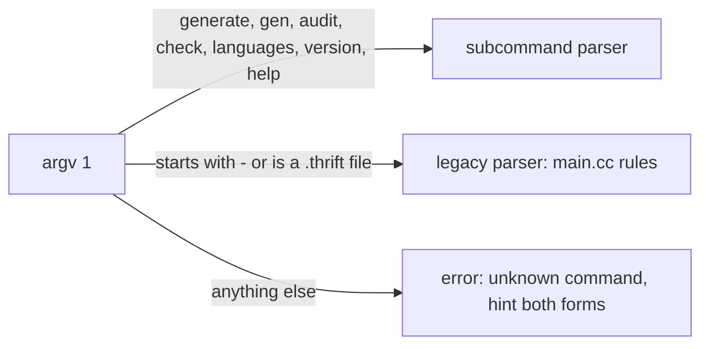

# thrift-go command line

Design note, 2026-09-21; implemented the same day. Companion to
[go-native-generator-plan.md](go-native-generator-plan.md).

`thrift-go` has a subcommand-based command line in the style of `go`,
`gofmt` and `buf`, keeps the C++ compiler's form working unchanged behind
it, and makes each generator's options real, documented flags instead of a
mini-language inside `--gen`. The sections below are the design; the
"Open questions" section records how each was settled.

## Today: the C++ form

`thrift-go` accepts exactly what `main.cc` accepts, because the build files
under `lib/`, `test/` and `tutorial/` and every user's Makefile depend on it.
The shape is `thrift [options] file`, and its parser is 100 lines of `strcmp`
that `main.cc` itself introduces with "Hacky parameter handling... I didn't
feel like using a library sorry!".

| Behaviour | Where | Consequence |
|---|---|---|
| One input file, always the last argument | `main.cc:1119` loops over `argv[1..argc-2]` | No `thrift a.thrift b.thrift`; one process per file |
| Every argument but the last is split on spaces (`strtok`) | `main.cc:1122` | `thrift "-r --gen go" x.thrift` works; a directory with a space in its name cannot be an option value |
| `--x` is rewritten to `-x` | `main.cc:1126` | No short/long distinction; `-r`, `-recurse`, `--recurse` are one flag |
| `-o dir` writes `dir/gen-go/`, `-out dir` writes `dir/` | `-o` vs `-out` | Two flags one letter apart with different layouts |
| Generator options are a mini-language in one flag | `--gen go:thrift_import=x,package_prefix=y,skip_remote` | Options are not validated until generation, have no `--help`, and cannot contain `,` or `:` |
| Warnings go to stdout, failures to stderr | `pwarning` (`printf`), `failure` (`fprintf(stderr)`) | `thrift ... > out` captures warnings; `2>/dev/null` hides the failure but keeps the warning |
| `--help` prints ~300 lines to stderr and exits 0 | `help()` | Every generator's options in one wall; no `help go` |
| Audit mode is a flag, not a mode | `-audit old.thrift ... new.thrift` | The "new" file is the positional; `-Iold`/`-Inew` are audit-only include flags |
| Exit codes 1, 2, 3, 255 | generic, audit failure, generator failure, bad `-o` dir | Undocumented outside the source |

`thrift-go` reproduces all of it today (`compiler/go/cmd/thrift-go/main.go`,
80 lines of loop), including the space-splitting and the dash-stripping, so
the autotools and Gradle invocations work with the binary swapped in. That
compatibility is the constraint this proposal keeps.

## What a Go user expects

The conventions below are what `go`, `gofmt`, `go vet`, `buf`, `gh` and
`golangci-lint` share; a Go developer reaches for them without reading the
help.

- **Verb first.** `go build`, `buf generate`, `buf lint`, `gh pr create`. One
  binary, subcommands for modes; `thrift generate` and `thrift audit` are
  modes, not flags.
- **Flags before positionals, many positionals.** `go build ./...`,
  `gofmt -w a.go b.go`. Flags are parsed by the standard `flag` package, which
  takes `-flag`, `--flag`, `-flag=value` and `-flag value` alike and stops at
  the first non-flag argument.
- **Repeat a flag to add to a list.** `-I dir1 -I dir2`, `--path a --path b`
  (buf). No space-separated bundles, no `strtok`.
- **`-h`/`--help` on every subcommand, to stdout, exit 0.** `go help build`,
  `buf generate --help`. A generator's options belong to that generator's
  help, not to a global wall.
- **stdout is for output, stderr is for diagnostics.** `go vet` writes
  `file:line:col: message` to stderr; a machine-readable listing
  (`go list -json`) goes to stdout.
- **Diagnostics carry `file:line:col`.** Editors and CI annotate them; GitHub
  Actions turns them into inline annotations for free.
- **Exit codes mean something.** `go vet`: 0 clean, 1 findings or error.
  `buf lint`: 100 for lint failures, 1 for errors. The number is documented.
- **`version` prints what the module system knows.** `debug.ReadBuildInfo`
  gives the module version and VCS revision, so `go install …@v0.27.0` and a
  distro build both report something true.
- **`go:generate` is the integration point.** A generated package carries
  `//go:generate thrift generate --lang go --out . ../idl/svc.thrift` and
  `go generate ./...` runs it; the command line has to be quotable on one line
  without shell tricks.
- **No config file, no environment magic** for a compiler. `gofmt` and
  `go vet` take everything from the command line; `buf` reads `buf.gen.yaml`
  because it drives many plugins, which is not this tool's job.

## The command line

The first word decides the mode; everything after it is standard `flag`
parsing followed by the positional arguments.

```
thrift generate [flags] file.thrift...      generate code (alias: gen)
thrift audit    [flags] old.thrift new.thrift
thrift check    [flags] file.thrift...      parse and validate, generate nothing
thrift decode   [flags] [file]              print Thrift-encoded bytes as a tree
thrift languages [--json]                   list generators and their options
thrift version
thrift help [command|exit-codes|legacy]
```

### generate

```
thrift generate --lang go \
    --out ./gen \
    -I ./idl \
    --go.thrift-import github.com/apache/thrift/lib/go/thrift \
    --go.package-prefix example.com/svc/gen/ \
    idl/svc.thrift idl/types.thrift
```

| Flag | Meaning | Replaces |
|---|---|---|
| `--lang L` | Target language; repeatable for several targets in one run | `--gen L:...` |
| `--out DIR` | Directory the files are written to, created if missing; default `.` | `-out DIR`; the `-o` variant with its `gen-L/` subdirectory is legacy-only |
| `-I DIR` | Include directory; repeatable | `-I` (unchanged) |
| `--recurse` | Also generate the included files | `-r` |
| `--strict`, `--no-warn` | As today | `-strict`, `-nowarn` |
| `--allow-neg-keys`, `--allow-64bit-consts` | As today | unchanged |
| `--L.option[=value]` | A generator option, namespaced by language: `--go.skip-remote`, `--java.beans`, `--java.generated-annotations=undated` | the `key=value,key` list inside `--gen` |

The generator options come from the registry: each generator declares its
options with a name, a type and one line of help, the CLI registers them as
`--L.name` flags, and `thrift generate --lang go --help` prints only Go's. A
typo in an option is a parse error before any file is read, not a message
during generation. Option names keep their C++ spelling with `_` accepted as
well as `-`, so `--go.thrift_import` and `--go.thrift-import` are the same
flag; the registry entry lists the canonical form.

Several input files are one run: one process, includes resolved once, files
that include each other generated once. This is what `-r` approximates today
by walking includes from a single root.

### audit

```
thrift audit --allow-optional-field-removal -I ./idl old/svc.thrift new/svc.thrift
```

The two files are positional in old-then-new order, the natural reading of
"audit old against new". `--include-old DIR` and `--include-new DIR` replace
`-Iold`/`-Inew`; `--no-fatal` replaces `-audit-nofatal`. Exit status 2 on a
failure stays, because scripts test for it.

### check

```
thrift check -I ./idl idl/*.thrift
```

Parses and validates without generating, which is what CI wants for an IDL
repository and what `-strict` with a throwaway `--gen` is used for today.
Exit 1 on any error or, with `--strict`, 2 when a warning was printed.

### languages

```
$ thrift languages
go     Go       (options: thrift-import, package-prefix, skip-remote, ...)
java   Java     (options: beans, android, private-members, ...)
$ thrift languages --json
```

Replaces the 300-line `--help`. The JSON form is for editors and build tools
that want to offer completions.

### go:generate

```go
//go:generate thrift generate --lang go --out . --go.package-prefix example.com/svc/gen/ ../idl/svc.thrift
```

One line, no quoting, `go generate ./...` runs it.

## Diagnostics, streams and exit codes

Every diagnostic goes to stderr in the `go vet` shape, and stdout carries
only what a caller would pipe: the `languages` listing and, with `--json`,
structured results.

```
idl/svc.thrift:68:5: warning: the "byte" type is a compatibility alias for "i8"
idl/svc.thrift:129:3: error: type "ThriftTest.UserId" not defined
idl/svc.thrift:12:1: audit failure: struct field removed for id 3 in Request
```

That needs the column in `token.Token`, which the front-end work adds anyway;
the parser already has the line. The C++ prefixes `[WARNING:path:line]`,
`[FAILURE:path:line]` and `[Thrift Audit Failure:path]` stay in legacy mode,
because `test/audit/thrift_audit_test.pl` and users' scripts grep for them.

| Exit | Meaning | Today |
|---|---|---|
| 0 | Success; warnings may have been printed | 0 |
| 1 | Usage error, unreadable input, parse or validation error | 1, and 255 for a bad `-o` directory |
| 2 | Audit found an incompatible change (`audit`); `check --strict` found a warning | 2 |
| 3 | A generator failed on a valid program | 3 |

The numbers keep their meaning so existing scripts that test `$? -eq 2` after
an audit keep working; 255 folds into 1. `thrift help exit-codes` documents
the table, which nothing does today.

## Compatibility: the legacy form stays

The C++ form is not deprecated and not removed. It is 80 lines, every
Makefile in the tree uses it, and every downstream build script does too;
breaking it would cost more goodwill than the new form earns.

Dispatch is by the first argument:



A legacy invocation always has its first argument start with `-` (`-r`,
`--gen`, `-I`, `-out`), or it is `thrift file.thrift` with no options, which
is a usage error in both forms. No existing command line begins with a
subcommand name, so the two parsers never overlap; a file literally named
`audit` or `check` needs `./audit`, the same rule `go run` applies.

What the legacy parser keeps, unchanged: single positional last, `strtok`
space-splitting of the other arguments, `--x` to `-x`, `-o` with the `gen-L/`
subdirectory, `--gen L:opts`, `-audit old`, `-Iold`/`-Inew`, the C++
diagnostic prefixes, and the C++ help text on `-help`. The parity tests in
`compiler/go/internal/parity` drive the legacy form and keep it honest.

What changes for legacy users: nothing until they choose to.
`lib/go/test/Makefile.am`, `test/go/Makefile.am`, `tutorial/go/Makefile.am`
and `lib/java/gradle/generateTestThrift.gradle` switch to the new form when
the Go compiler becomes the reference for their language, as the worked
example that the documentation points at.

## Implementation

Standard library only: `flag.NewFlagSet` per subcommand and a 30-line
dispatcher. No cobra, kong or urfave/cli. The reasons are specific to this
repository rather than taste:

- `go.mod` is `module github.com/apache/thrift` with zero requirements, and
  `lib/go/thrift` lives in it. A CLI library would enter every Thrift user's
  module graph and `go.sum`. Splitting the compiler into its own module costs
  a second tag per release and breaks the property that one tag versions
  runtime and compiler together.
- `flag` already does what the proposal needs: `-x`/`--x` equivalence, `=` or
  space for values, `-h`/`--help` per set, `flag.Value` for repeatable flags
  (`-I`, `--lang`) in six lines, and `Usage` hooks for the per-language help.
- What `flag` lacks and the proposal does without: flags after positionals
  (`go build` has the same rule), shell completion (`languages --json` gives a
  completion script its data), and a config file (see the previous section).

The pieces, in the order they land:

| Step | Files | Size (estimate) | Depends on |
|---|---|---|---|
| Generator registry with option metadata: name, type, help, canonical spelling | new `compiler/go/generate/registry.go`; `golang/run.go`, `java/run.go` register themselves | ~120 lines plus one table per generator | nothing |
| Subcommand dispatcher and `generate`, `audit`, `check`, `languages`, `version`, `help` | `compiler/go/cmd/thrift-go/main.go` split into `main.go`, `legacy.go`, `generate.go`, `audit.go`, `check.go`, `languages.go` | ~400 lines; the legacy loop moves to `legacy.go` unchanged | registry |
| Multiple input files per run | `sema.Loader` already caches includes across `Load` calls (the `known` map); the driver loops | ~30 lines | none |
| `file:line:col` diagnostics | `idl/token` gains `Column`; `sema.Diagnostics` gains a second formatter selected by mode | ~80 lines | token positions |
| `version` from build info | `internal/version` falls back to `debug.ReadBuildInfo` when the constant is the dev value | ~20 lines | none |
| Tests | table-driven `main_test.go` running the binary on both forms with golden stderr; the parity tests keep driving the legacy form | ~200 lines | all of the above |

The `--L.name` flags are generated from the registry at startup: for each
registered language, each option becomes a flag on the `generate` set with
the prefix. `flag` allows dots in names. A flag given for a language that is
not in `--lang` is an error ("`--java.beans` given but java is not a
target"), which catches the copy-paste mistakes the mini-language swallows
today.

## Not in this proposal

- **Removing the legacy form.** Ever. It is cheap and it is the
  compatibility promise.
- **A config file** (`thrift.yaml`). `buf` needs one because it orchestrates
  plugins; a single compiler does not. Revisit only if a plugin model is ever
  adopted.
- **Watch mode, `fmt`, `lint` rules beyond what `sema` already checks.** Each
  is a separate proposal with its own users.
- **Changing generator option names.** `thrift_import` stays `thrift_import`
  (with `thrift-import` accepted); renaming would break the mini-language
  form that legacy mode keeps.
- **Renaming the binary to `thrift`.** That is the PMC's decision at the
  flip; the proposal works under either name.

## Open questions, as settled

1. `--L.option` versus `--opt L:key=value`: the namespaced flag, because it
   is validated and documented per flag. Both spellings of an option name
   are flags (`--go.thrift_import`, `--go.thrift-import`); a flag for a
   language that is not a `--lang` target is an error.
2. `generate` defaults `--out` to `.` (the `-out` rule), matching every Go
   generator (`protoc-gen-go`, `sqlc`, `oapi-codegen`); `gen-L/` stays with
   the legacy `-o`.
3. `check --strict` exits 2 like `audit`, so that "the input is fine but
   violates a policy" is one status across modes.
4. `languages --json` ships; it is forty lines and the registry already
   holds the data.

Also implemented beyond the design: `decode`, which prints Thrift-encoded
bytes as a tree, without an IDL or annotated from one with `--idl`, and
`help legacy`, which prints the C++ compiler's help text.
