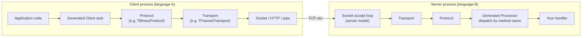

# The Thrift mental model

> **Applies to Apache Thrift 0.24.0.**

Apache Thrift is a small family of tools that solve one problem: letting a
program written in one language call code in another language over a
network, with a data schema both sides agree on. The pieces:

1. **IDL** — you describe your data types and service methods in a
   `.thrift` file (the *interface definition language*).
2. **Compiler** — the `thrift` compiler parses that file and emits
   serialization/deserialization code plus client and server plumbing for
   each target language you request.
3. **Runtime libraries** — per-language libraries (`libthrift`, the `thrift`
   PyPI/npm/crates packages, `lib/go/thrift`, …) supply the wire machinery
   the generated code calls into: protocols, transports, servers.
4. **Your handlers** — you implement the service interface the compiler
   generated; everything below it is plumbing.

The word "Thrift" is used loosely for all four layers. Being precise about
which layer a behavior belongs to is half of debugging Thrift:

| Layer | What it decides | Example of a behavior owned here |
|---|---|---|
| Wire format (specs) | exact bytes | field IDs, type encoding, message header |
| IDL / compiler | what code is generated | `required` enforcement points, option flags |
| Runtime library | I/O behavior | timeouts, size limits, TLS, server threading |
| Generated code | the bridge | `read`/`write`/client stubs per struct and service |
| Application | policy | validation, retries, logging, business logic |

## The call path



If your viewer does not render Mermaid, the same picture as text:

```
client app -> generated client stub -> protocol -> transport -> socket
                                                              | network
server accept loop  <- transport <- protocol <- generated processor <- your handler
```

A request in motion:

1. Your code calls `client.getInstrument(selector)`.
2. The generated client writes a **message**: method name, a message type
   (`CALL`), a sequence id, then the argument struct.
3. The **protocol** encodes that message (binary, compact, JSON…).
4. The **transport** moves encoded bytes (optionally adding framing or
   compression), and `flush()` marks a message boundary.
5. The server's accept loop hands the connection to the protocol +
   processor, which reads the method name and dispatches to your handler.
6. The response travels the reverse path with message type `REPLY` (or
   `EXCEPTION` for declared, typed errors).

## The stack is composable — that's the point

Protocol and transport are independent choices:

- **Protocol**: how a struct becomes bytes. Binary (simple, fast, universal),
  compact (same semantics, varint encoding, smaller), JSON (text, debuggable),
  plus a few language-specific ones.
- **Transport**: how bytes move and whether messages are delimited. Sockets,
  HTTP; wrappers like framed (length-prefixes each message) or buffered
  (batches writes until `flush()`).
- **Server model** (server side only): how connections map to threads or
  goroutines. Blocking single-connection, thread-per-connection, thread
  pool, nonblocking selectors — availability differs per language.

**Both ends must agree on protocol and transport.** The protocol is visible
on the wire. The transport is visible too, but differently: framed transport
on one side and unframed on the other produces a connection that hangs or
errors on the first call. This is the single most common first-week mistake;
see [troubleshooting](practical-guide/troubleshooting.html).

## What is interoperable, and on what terms

**Guaranteed by the wire format** (all implementations of the specs agree):

- struct/field encoding by **field ID** and type, not by position or name
- the meanings of `CALL`/`REPLY`/`EXCEPTION`/`ONEWAY` message types
- container and primitive encodings (including `uuid` as 16 bytes where
  supported — see [IDL design](practical-guide/idl-design.html#uuid))
- skipping fields the reader does not know (the basis of schema evolution)

**Conditional — must be checked per language and release:**

- which protocols and transports a runtime implements at all (the
  [matrix](/docs/Languages) is the starting point, but note its version
  header lags the latest release)
- which server models exist (Go 0.24.0, for example, ships exactly one
  server type, `TSimpleServer`)
- how strictly union "exactly one member" semantics are enforced in
  generated code (they are not, uniformly — see
  [IDL design](practical-guide/idl-design.html#unions))
- optional-size behavior like compression or header transports
  (THeader exists in C++, Go, Python, and Node.js, but not Java or .NET
  in 0.24.0)

**Never interoperable by accident:**

- defaults and validation rules that live only in application code
- authentication (Thrift defines transports such as SASL in some runtimes,
  but nothing like a standard per-service auth policy)

## Reading generated code without fear

For a struct `Instrument`, roughly the same shape appears in every
language:

- fields, one per IDL field, plus per-field "is set" tracking where the
  language needs it (Java `isSetX()`, Python `None`-check, Go pointers)
- `read(protocol)` and `write(protocol)` methods that encode field ID +
  type + value per set field, ending with a stop field
- equality, hashing, printing helpers

For a service `ReferenceDataQuery`:

- an **interface** (`Iface` in Java, an interface type in Go) — this is
  what your handler implements
- a **Client** with one method per IDL function
- a **Processor** that demultiplexes incoming calls by method name to the
  handler

**Never edit generated files.** Regenerate instead; the compiler is
deterministic for a given IDL + options. Build systems in this guide's
[examples](https://github.com/apache/thrift/tree/master/doc/practical-guide/examples)
show how to make regeneration a normal build step.

## Where to next

- See the stack work end-to-end:
  [a first end-to-end service](practical-guide/first-service.html)
- Then learn how to design contracts that evolve safely:
  [IDL design](practical-guide/idl-design.html)
